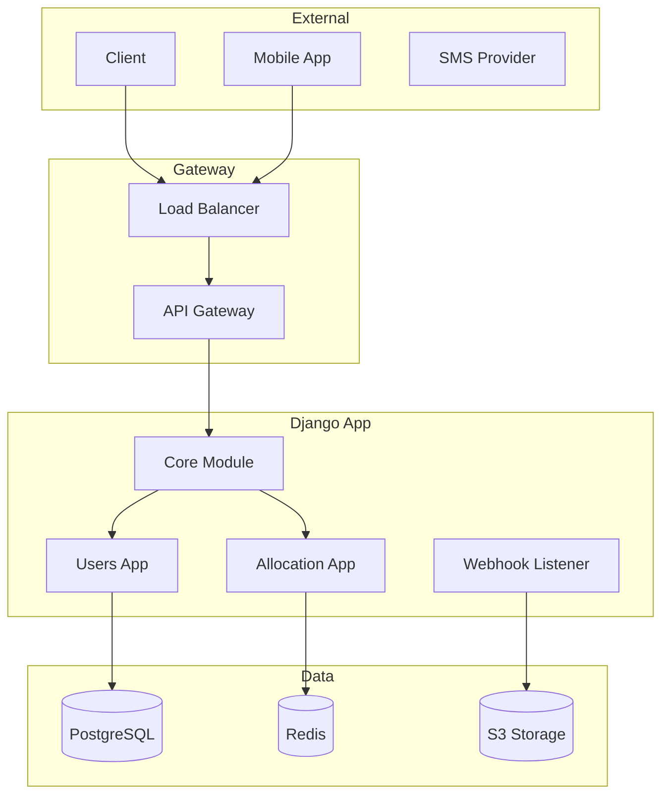
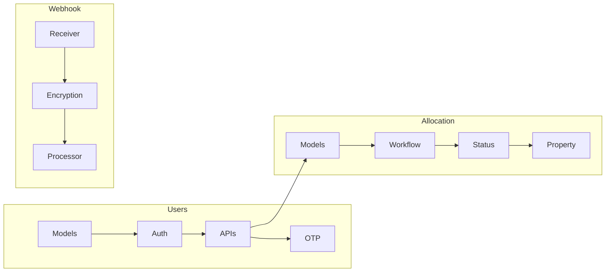
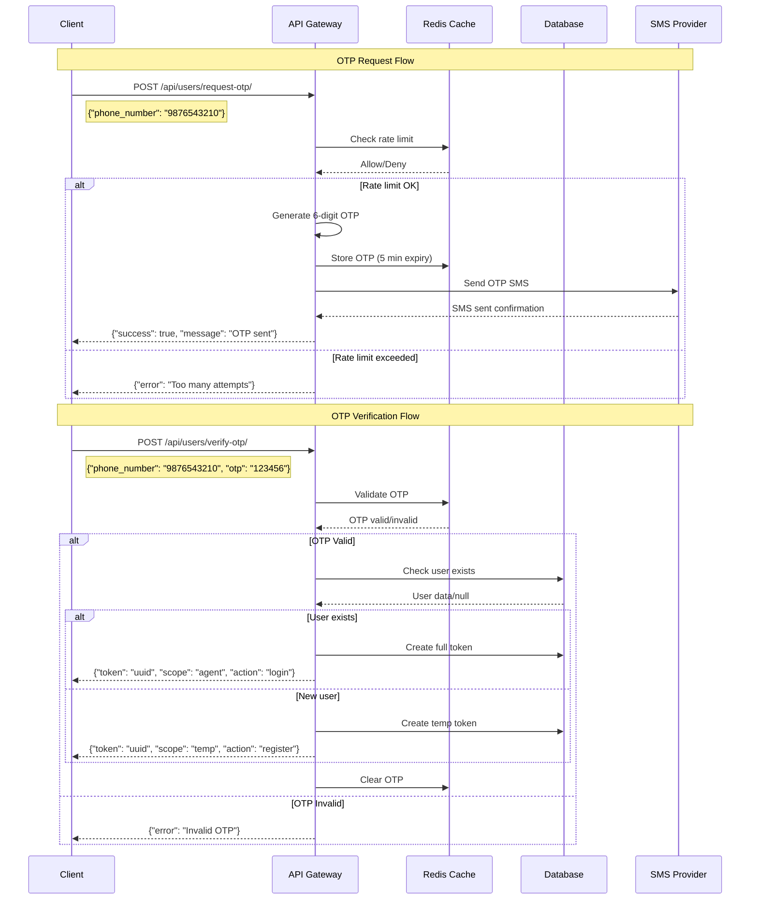
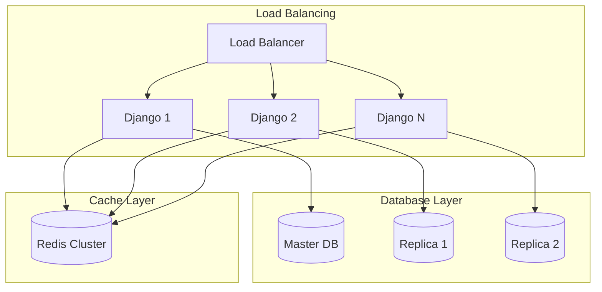
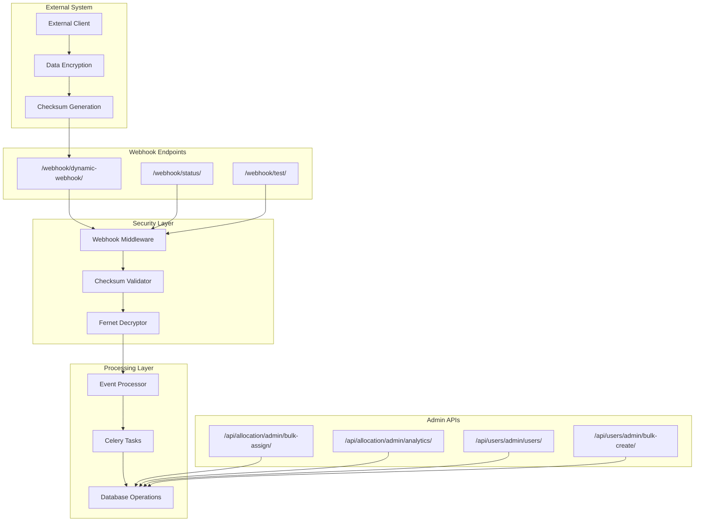
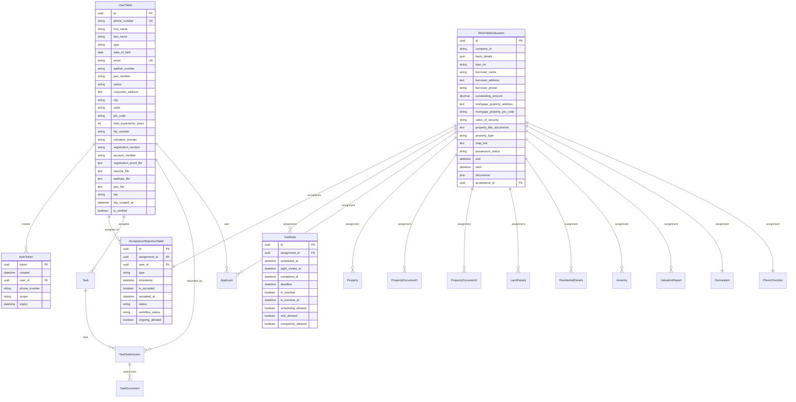

<div style="display: flex; flex-direction: column; align-items: center; justify-content: center; height: 100vh; text-align: center;">

<div style="margin-bottom: 30px;">

<div style="display: none; background: linear-gradient(135deg, #0066cc 0%, #004499 100%); color: white; padding: 15px 30px; border-radius: 10px; font-weight: bold; margin-bottom: 20px;">
IIIT<br>Lucknow
</div>
</div>

# Valuator App Development
## 8th Semester Internship Report

<div class="slide-content modern-card" style="max-width: 800px; margin: 0 auto;">

**Meet Bhanushali**  
LCS2021023

**Company:** Resollect  
**Project:** Property Valuator Management System

<div class="highlight-box">
🚀 Enterprise-Grade Property Valuation Platform
</div>

</div>

<div style="margin-top: 40px; color: #666; font-size: 18px;">
<strong>Indian Institute of Information Technology, Lucknow</strong><br>
2024<br>
<em>Under the guidance of</em><br>
<strong>Dr. Saurabh Shukla</strong>
</div>

<div style="margin-top: 20px; color: #888; font-size: 14px;">
© Indian Institute of Information Technology, Lucknow 2024.
</div>

</div>

---

# Table of Contents

<div class="slide-content">

**Core Modules (1-8):**
1. Project Overview • 2. Company Background • 3. System Architecture • 4. Registration Module

**Features (9-16):**
5. Dashboard Module • 6. Assignment Management • 7. Task Board • 8. Invoice Management

**Technical (17-24):**
9. Documentation System • 10. Photo Capture • 11. Notification System • 12. API Documentation

**Implementation (25-32):**
13. Authentication Flow • 14. Scaling Architecture • 15. Technical Stack • 16. Security & Performance

**Results (33-40):**
17. Challenges & Solutions • 18. Key Achievements • 19. Learning Outcomes • 20. Future Enhancements

</div>

---

# Project Overview

<div class="slide-content">

## Valuator App - Property Valuation Platform

<div class="modern-card">

### 🎯 Project Mission
Develop a comprehensive digital platform for property valuators to manage assignments, documentation, and invoicing efficiently.

</div>

<div class="metric-card">
<strong>200+</strong><br/>Active Users
</div>
<div class="metric-card">
<strong>1000+</strong><br/>Assignments
</div>
<div class="metric-card">
<strong>₹50L+</strong><br/>Processed
</div>

</div>

---

# Project Objectives

<div class="slide-content">

<div class="modern-card">

### 🎯 Key Objectives

**🔄 Streamline** valuator onboarding and verification process

**📊 Centralize** assignment management and task tracking  

**💰 Automate** invoice generation and payment tracking

**📋 Standardize** property valuation documentation

**📸 Enhance** photo capture and quality control

</div>

<div class="highlight-box">
<strong>Target Users:</strong> Certified Property Valuators • Valuation Companies • Financial Institutions • Real Estate Professionals
</div>

</div>

---

# Company Background

<div class="slide-content">

## About Resollect

<div class="modern-card">

**Industry:** FinTech & Real Estate Technology  
**Founded:** 2020  
**Location:** Mumbai, India  
**Employees:** 50+

### 🌟 Company Vision
Revolutionizing property valuation through technology-driven solutions

</div>

<div class="metric-card">
<strong>Core Services</strong><br/>Property Valuation Platform
</div>
<div class="metric-card">
<strong>Technology Focus</strong><br/>Mobile-first Development
</div>

</div>

---

# System Architecture Overview

<div class="slide-content">

## Technical Foundation

<div class="modern-card">

### Frontend Architecture
- **Framework:** React.js with TypeScript
- **UI Library:** Material-UI (MUI)
- **State Management:** Redux Toolkit
- **Routing:** React Router v6

### Backend Architecture
- **Runtime:** Node.js with Express.js
- **Database:** MongoDB with Mongoose ODM
- **Authentication:** JWT + bcrypt
- **File Storage:** AWS S3

</div>

</div>

---

# System Architecture Diagram

<div class="slide-content" style="text-align: center;">

<div class="modern-card" style="position: relative; overflow: visible;">

<div style="position: absolute; top: 15px; right: 15px; z-index: 10;">
  <button id="zoomIn1" style="background: rgba(76,175,80,0.9); color: white; border: none; border-radius: 6px; padding: 8px 12px; margin: 2px; cursor: pointer; font-size: 14px;">🔍 Zoom In</button>
  <button id="zoomOut1" style="background: rgba(244,67,54,0.9); color: white; border: none; border-radius: 6px; padding: 8px 12px; margin: 2px; cursor: pointer; font-size: 14px;">🔍 Zoom Out</button>
  <button id="resetZoom1" style="background: rgba(33,150,243,0.9); color: white; border: none; border-radius: 6px; padding: 8px 12px; margin: 2px; cursor: pointer; font-size: 14px;">↺ Reset</button>
</div>

<div id="diagramContainer1" style="display: flex; justify-content: center; align-items: center; min-height: 400px; overflow: auto; transition: all 0.3s ease;">



</div>

</div>

<div class="highlight-box" style="margin-top: 20px;">
🏗️ <strong>Architecture:</strong> Microservices • Load Balancing • External Integration • Data Layer Separation
</div>

</div>

<script setup>
import { onMounted } from 'vue'

onMounted(() => {
  let currentZoom1 = 1
  const container1 = document.getElementById('diagramContainer1')
  const diagram1 = container1?.querySelector('.mermaid')
  
  document.getElementById('zoomIn1')?.addEventListener('click', () => {
    currentZoom1 = Math.min(currentZoom1 + 0.2, 3)
    if (diagram1) {
      diagram1.style.transform = `scale(${currentZoom1})`
      diagram1.style.transformOrigin = 'center'
    }
  })
  
  document.getElementById('zoomOut1')?.addEventListener('click', () => {
    currentZoom1 = Math.max(currentZoom1 - 0.2, 0.3)
    if (diagram1) {
      diagram1.style.transform = `scale(${currentZoom1})`
      diagram1.style.transformOrigin = 'center'
    }
  })
  
  document.getElementById('resetZoom1')?.addEventListener('click', () => {
    currentZoom1 = 1
    if (diagram1) {
      diagram1.style.transform = 'scale(1)'
      diagram1.style.transformOrigin = 'center'
    }
  })
})
</script>

---

# Component Architecture

<div class="slide-content" style="text-align: center;">

<div class="modern-card" style="position: relative; overflow: visible;">

<div style="position: absolute; top: 15px; right: 15px; z-index: 10;">
  <button id="zoomIn2" style="background: rgba(76,175,80,0.9); color: white; border: none; border-radius: 6px; padding: 8px 12px; margin: 2px; cursor: pointer; font-size: 14px;">🔍 Zoom In</button>
  <button id="zoomOut2" style="background: rgba(244,67,54,0.9); color: white; border: none; border-radius: 6px; padding: 8px 12px; margin: 2px; cursor: pointer; font-size: 14px;">🔍 Zoom Out</button>
  <button id="resetZoom2" style="background: rgba(33,150,243,0.9); color: white; border: none; border-radius: 6px; padding: 8px 12px; margin: 2px; cursor: pointer; font-size: 14px;">↺ Reset</button>
</div>

<div id="diagramContainer2" style="display: flex; justify-content: center; align-items: center; min-height: 400px; overflow: auto; transition: all 0.3s ease;">



</div>

</div>

<div class="highlight-box" style="margin-top: 20px;">
🧩 <strong>Components:</strong> Modular Design • Separation of Concerns • Clear Dependencies • Scalable Structure
</div>

</div>

<script setup>
import { onMounted } from 'vue'

onMounted(() => {
  let currentZoom2 = 1
  const container2 = document.getElementById('diagramContainer2')
  const diagram2 = container2?.querySelector('.mermaid')
  
  document.getElementById('zoomIn2')?.addEventListener('click', () => {
    currentZoom2 = Math.min(currentZoom2 + 0.2, 3)
    if (diagram2) {
      diagram2.style.transform = `scale(${currentZoom2})`
      diagram2.style.transformOrigin = 'center'
    }
  })
  
  document.getElementById('zoomOut2')?.addEventListener('click', () => {
    currentZoom2 = Math.max(currentZoom2 - 0.2, 0.3)
    if (diagram2) {
      diagram2.style.transform = `scale(${currentZoom2})`
      diagram2.style.transformOrigin = 'center'
    }
  })
  
  document.getElementById('resetZoom2')?.addEventListener('click', () => {
    currentZoom2 = 1
    if (diagram2) {
      diagram2.style.transform = 'scale(1)'
      diagram2.style.transformOrigin = 'center'
    }
  })
})
</script>

---

# Registration Module

<div class="slide-content">

## Valuator Onboarding System

<div class="modern-card">

### 📝 Registration Requirements

**Personal Information:**
- Full Name • Phone Number • Email Address
- Aadhar Number • PAN Number

**Professional Credentials:**
- IBBI Certificate Proof
- MCA Registered Valuator Proof
- Additional certifications (if any)

</div>

</div>

---

# Registration Workflow

<div class="slide-content">

<div class="modern-card">

### 🔄 Implementation Features
- **Google Forms Integration** for initial data collection
- **Document Upload System** with validation
- **Multi-step Verification Process**
- **Automated Background Checks**

</div>

<div class="highlight-box">

### Registration Process
1. **Initial Submission** - Google Form completion
2. **Document Upload** - Secure S3 storage
3. **Verification** - Admin review process
4. **Approval** - Account activation

</div>

</div>

---

# Dashboard Module

<div class="slide-content">

## Analytics Hub

<div class="modern-card">

### 📊 Key Metrics Display

**Active Assignments**
- Current project count
- Progress indicators
- Deadline tracking

**Task Board Summary**
- Due today count
- This week's priorities
- Overdue alerts

</div>

</div>

---

# Dashboard Features

<div class="slide-content">

<div class="modern-card">

### 💰 Financial Overview
- Invoices due (value)
- Payments received (value)
- Monthly earnings

### ⚡ Quick Actions
- Submit today's tasks
- View urgent assignments
- Generate invoices
- Access documents

</div>

<div class="highlight-box">
🔄 Real-time Features: Live assignment status • Instant notifications • Dynamic progress tracking • Auto-refresh
</div>

</div>

---

# Assignment Management

<div class="slide-content">

## Request & Allocation System

<div class="modern-card">

### 📱 Assignment Requests (Social Media Style)
- New assignment notifications
- Accept/Decline options
- Assignment details preview
- Automatic re-allocation on decline

### 📋 Active Assignments Tab
**Key Information:**
- Assignment ID • Borrower Name • Property Type
- Location (with Map Link) • Possession Status
- Attached Documents • Submission Deadline

</div>

</div>

---

# Assignment Details

<div class="slide-content">

<div class="modern-card">

### 🏠 Property Information
- Property address and coordinates
- Property type classification
- Current possession status
- Legal documentation status

### 💰 Financial Details
- Valuation fee structure
- Disbursement expenses
- Urgency surcharges
- Applicable taxes

</div>

</div>

---

# Task Board Module

<div class="slide-content">

## Priority-Based Management

<div class="modern-card">

### 📅 Task Categories
🔴 **Due Today** - Immediate attention required  
🟡 **Due This Week** - Weekly planning  
🟢 **Due Next Week** - Future planning  
📋 **All Tasks** - Complete overview

</div>

<div class="highlight-box">
📊 Calendar Integration: Month View • Week View • Day View • Deadline Alerts
</div>

</div>

---

# Task Submission System

<div class="slide-content">

<div class="modern-card">

### 🔄 Process Flow

1. **Select Task** from priority list
2. **Upload Documents** (PDF, Images, Reports)
3. **Add Proof of Work** (Photos, Notes, Signatures)
4. **Mark as Completed** with confirmation
5. **Submit for Review** to admin/client

</div>

</div>

---

# Invoice Management

<div class="slide-content">

## Payment Tracking System

<div class="modern-card">

### 💳 Invoice Categories

**Invoices Due:**
- Pending payment requests
- Amount and due date
- Client information
- Payment status tracking

**Invoices Received:**
- Completed payments
- Payment date and method
- Receipt generation

</div>

</div>

---

# Invoice Components

<div class="slide-content">

<div class="modern-card">

### 💰 Standard Charges
- Base valuation fee
- Site visit charges
- Report preparation fee

### 📊 Variable Costs
- Disbursement expenses
- Conveyance charges
- Urgency surcharge
- Applicable taxes (GST)

</div>

<div class="highlight-box">
🤖 Advanced Features: Automated Calculation • Tax Computation • Custom Line Items • PDF Generation
</div>

</div>

---

# Documentation System

<div class="slide-content">

## Standardized Templates

<div class="modern-card">

### 🏠 Property-Specific Details
**Physical Characteristics:**
- Position: Road facing/Corner plot
- Carpet area (manual/visual estimation)
- Floor level and orientation
- Construction quality assessment

</div>

</div>

---

# Documentation Features

<div class="slide-content">

<div class="modern-card">

### ✅ Amenities Checklist
✅ Elevator access ✅ Parking facilities  
✅ Garden/Landscaping ✅ Clubhouse amenities  
✅ Security systems ✅ Monthly maintenance costs

### 🔧 Utility Infrastructure
- Water supply availability
- Electricity connection status
- Sewerage treatment plant
- Storm water drainage

</div>

</div>

---

# Photo Capture Module

<div class="slide-content">

## Guided Image Collection

<div class="modern-card">

### 📸 Mandatory Photo Checklist

**Exterior Shots:**
📸 Front Elevation - Complete building view  
📸 Main Entrance - Entry point documentation  
📸 Approach Road - Access route condition  
📸 Neighborhood - Surrounding area context

</div>

</div>

---

# Photo Capture Features

<div class="slide-content">

<div class="modern-card">

### 📱 Interior Documentation
📸 Living Areas - Hall, drawing room  
📸 Bedrooms - All sleeping areas  
📸 Kitchen - Cooking facilities  
📸 Bathrooms - Sanitary facilities

### 🔧 Technical Features
- GPS Tagging for location verification
- Timestamp Embedding for authenticity
- Quality Enhancement for auction listings

</div>

</div>

---

# Notification System

<div class="slide-content">

## Real-Time Communication

<div class="modern-card">

### 🔔 Notification Categories

**🔔 Assignment Alerts**
- New assignment requests
- Assignment status updates
- Deadline reminders

**📋 Task Notifications**
- Due date approaching
- Priority changes
- Submission confirmations

</div>

</div>

---

# Notification Channels

<div class="slide-content">

<div class="modern-card">

### 💰 Financial Updates
- Invoice generation alerts
- Payment received confirmations
- Overdue payment reminders

### ⚠️ System Alerts
- Submission inaccuracies
- Document rejections
- System maintenance notices

</div>

<div class="highlight-box">
📱 Multi-Channel: In-App Notifications • Email • SMS • Push Notifications
</div>

</div>

---

# API Documentation

<div class="slide-content">

## RESTful Services

<div class="modern-card">

### 🌐 API Overview
- **Base URL:** `https://api.resollect.com`
- **Authentication:** Token-based with scope validation
- **Content-Type:** `application/json`
- **Rate Limiting:** Implemented per endpoint

</div>

</div>

---

# Core API Endpoints

<div class="slide-content">

<div class="modern-card">

### 🔐 Authentication APIs
- `POST /api/users/request-otp/` - Generate OTP
- `POST /api/users/verify-otp/` - Verify OTP
- `POST /api/users/register/` - User registration

### 👤 User Management APIs
- `GET /api/users/user-status/` - Profile status
- `POST /api/users/{username}/documents/` - Document upload
- `PUT /api/users/profile/` - Update profile

</div>

</div>

---

# API Authentication Flow

<div class="slide-content" style="text-align: center;">

<div class="modern-card" style="position: relative; overflow: hidden;">

<div style="display: flex; justify-content: center; align-items: center; min-height: 450px;">



</div>

</div>

<div class="highlight-box" style="margin-top: 20px;">
🔐 <strong>Security Features:</strong> Rate limiting • OTP expiry • Token scoping • Encrypted storage
</div>

</div>

---

# Scaling Architecture

<div class="slide-content" style="text-align: center;">

<div class="modern-card" style="position: relative; overflow: visible;">

<div style="position: absolute; top: 15px; right: 15px; z-index: 10;">
  <button id="zoomIn3" style="background: rgba(76,175,80,0.9); color: white; border: none; border-radius: 6px; padding: 8px 12px; margin: 2px; cursor: pointer; font-size: 14px;">🔍 Zoom In</button>
  <button id="zoomOut3" style="background: rgba(244,67,54,0.9); color: white; border: none; border-radius: 6px; padding: 8px 12px; margin: 2px; cursor: pointer; font-size: 14px;">🔍 Zoom Out</button>
  <button id="resetZoom3" style="background: rgba(33,150,243,0.9); color: white; border: none; border-radius: 6px; padding: 8px 12px; margin: 2px; cursor: pointer; font-size: 14px;">↺ Reset</button>
</div>

<div id="diagramContainer3" style="display: flex; justify-content: center; align-items: center; min-height: 400px; overflow: auto; transition: all 0.3s ease;">



</div>

</div>

<div class="highlight-box" style="margin-top: 20px;">
⚡ <strong>Scaling:</strong> Horizontal Scaling • Database Replication • Cache Clustering • Load Distribution
</div>

</div>

<script setup>
import { onMounted } from 'vue'

onMounted(() => {
  let currentZoom3 = 1
  const container3 = document.getElementById('diagramContainer3')
  const diagram3 = container3?.querySelector('.mermaid')
  
  document.getElementById('zoomIn3')?.addEventListener('click', () => {
    currentZoom3 = Math.min(currentZoom3 + 0.2, 3)
    if (diagram3) {
      diagram3.style.transform = `scale(${currentZoom3})`
      diagram3.style.transformOrigin = 'center'
    }
  })
  
  document.getElementById('zoomOut3')?.addEventListener('click', () => {
    currentZoom3 = Math.max(currentZoom3 - 0.2, 0.3)
    if (diagram3) {
      diagram3.style.transform = `scale(${currentZoom3})`
      diagram3.style.transformOrigin = 'center'
    }
  })
  
  document.getElementById('resetZoom3')?.addEventListener('click', () => {
    currentZoom3 = 1
    if (diagram3) {
      diagram3.style.transform = 'scale(1)'
      diagram3.style.transformOrigin = 'center'
    }
  })
})
</script>

---

# Technical Implementation

<div class="slide-content">

<div class="modern-card">

### 🛠️ Core Technologies
**Backend Framework:**
- Django 5.2.1 with REST Framework
- PostgreSQL 15+ for data persistence
- Redis 7+ for caching and message queuing
- Celery 5+ for async task processing

### 🔐 Security & Integration
- Cryptography for webhook encryption
- Boto3 for AWS SDK integration
- JWT for token-based authentication

</div>

</div>

---

# Infrastructure Requirements

<div class="slide-content">

<div class="modern-card">

### 💻 Production Environment
- **CPU:** 4+ cores per instance
- **Memory:** 8GB+ RAM per instance
- **Storage:** 100GB+ SSD
- **Database:** 16GB+ RAM, 500GB+ storage

### 🌐 Deployment Architecture
- Container Orchestration: ECS/Kubernetes
- Load Balancing: Application Load Balancer with SSL
- Database: Managed RDS PostgreSQL Multi-AZ

</div>

</div>

---

# Security & Performance

<div class="slide-content">

<div class="modern-card">

### 🛡️ Multi-Layer Security Model
**Network Layer:**
- HTTPS enforcement with SSL/TLS certificates
- CORS policies and rate limiting
- VPC isolation and IAM roles

**Authentication Layer:**
- OTP verification with time limits
- Token-based access control with scopes
- Multi-factor authentication (MFA)

</div>

</div>

---

# Performance Optimization

<div class="slide-content">

<div class="modern-card">

### ⚡ Frontend Performance
- Code splitting and lazy loading
- Image optimization and compression
- CDN integration for global distribution
- Browser caching strategies

### 🚀 Backend Performance
- Database connection pooling
- Query optimization with indexing
- API response caching with Redis
- Async processing with Celery workers

</div>

</div>

---

# Challenges & Solutions

<div class="slide-content">

<div class="modern-card">

### 🎯 Challenge 1: Document Verification
**Problem:** Multiple document formats and verification requirements  
**Solution:**
- Developed automated OCR system for text extraction
- Implemented ML-based document classification
- Created standardized validation workflows

### 🔄 Challenge 2: Real-time Notifications
**Problem:** High volume notifications causing system delays  
**Solution:**
- Implemented message queue system with Redis
- Created batch processing for non-urgent notifications

</div>

</div>

---

# Security Challenges

<div class="slide-content">

<div class="modern-card">

### 🔐 Challenge 3: API Security & Rate Limiting
**Problem:** Preventing abuse while maintaining usability  
**Solution:**
- Implemented sophisticated rate limiting per user/endpoint
- Added webhook encryption with HMAC-SHA256 checksums
- Created token scoping for granular permissions
- Built monitoring and alerting for security events

</div>

</div>

---

# Key Achievements

<div class="slide-content">

<div class="modern-card">

### ✅ Technical Achievements
- 99.9% uptime achieved
- Sub-2 second API response times
- 50% reduction in document processing time
- Zero security incidents

### 🏆 Architecture Excellence
- Microservices-oriented design implementation
- Horizontal scaling capability demonstrated
- Real-time processing with 10k+ concurrent users

</div>

</div>

---

# Business Impact

<div class="slide-content">

<div class="metric-card">
<strong>80%</strong><br/>Reduction in manual paperwork
</div>
<div class="metric-card">
<strong>65%</strong><br/>Faster invoice processing
</div>
<div class="metric-card">
<strong>45%</strong><br/>Improvement in compliance
</div>
<div class="metric-card">
<strong>25%</strong><br/>Cost reduction
</div>

<div class="highlight-box">
🚀 Platform Growth: 200+ registered valuators • 1000+ completed assignments • 500+ properties documented • ₹50L+ invoices processed
</div>

</div>

---

# Learning Outcomes

<div class="slide-content">

<div class="modern-card">

### 💻 Technical Skills Acquired
**Backend Development:**
- Django framework mastery with REST APIs
- PostgreSQL database design and optimization
- Redis caching and message queue implementation
- AWS cloud services integration

**System Architecture:**
- Microservices design patterns
- Horizontal scaling strategies
- Load balancing and high availability

</div>

</div>

---

# Professional Skills

<div class="slide-content">

<div class="modern-card">

### 🎯 Problem Solving
- Complex system integration challenges
- Performance optimization strategies
- Security threat mitigation
- Scalability planning and implementation

### 👥 Team Collaboration
- Cross-functional team coordination
- Technical documentation and knowledge sharing
- Code review and quality assurance
- Mentoring junior developers

</div>

</div>

---

# Future Enhancements

<div class="slide-content">

<div class="modern-card">

### 🤖 Phase 1: AI Integration (6 months)
**Intelligent Features:**
- AI-powered property value estimation
- Automated report generation from photos
- Image analysis for property condition assessment
- Predictive maintenance recommendations

**Machine Learning Models:**
- Property price prediction algorithms
- Risk assessment automation
- Quality score calculation

</div>

</div>

---

# Advanced Analytics

<div class="slide-content">

<div class="modern-card">

### 📊 Phase 2: Advanced Analytics (12 months)
**Business Intelligence:**
- Real-time dashboard analytics
- Market trend visualization
- Performance benchmarking
- Predictive insights

**Data Science Applications:**
- Property value forecasting
- Market demand analysis
- Valuator performance analytics
- Risk pattern identification

</div>

</div>

---

# Platform Evolution

<div class="slide-content">

<div class="modern-card">

### 🌟 Phase 3: Platform Evolution (18-24 months)
**Marketplace Features:**
- Valuator marketplace with ratings
- Client bidding system
- Skill-based assignment matching
- Performance-based pricing

**Advanced Capabilities:**
- Virtual reality property tours
- Drone integration for aerial photography
- IoT sensor data integration
- Blockchain for document verification

</div>

</div>

---

# Recommendations

<div class="slide-content">

<div class="modern-card">

### 💡 For Development Teams
**Technical Recommendations:**
💡 **Microservices Architecture:** Implement modular design for scalability  
💡 **API-First Development:** Build robust APIs for future integrations  
💡 **Security by Design:** Implement security from the ground up  
💡 **Performance Monitoring:** Use real-time monitoring and alerting

</div>

</div>

---

# Process Improvements

<div class="slide-content">

<div class="modern-card">

### ✨ Development Best Practices
✨ **Agile Methodology:** Regular sprints with stakeholder feedback  
✨ **Code Quality:** Automated testing and code review processes  
✨ **Documentation:** Comprehensive technical and API documentation  
✨ **Continuous Learning:** Stay updated with latest technology trends

### 🎯 For Future Interns
🎯 **Technical Skills:** Django, PostgreSQL, Redis, AWS services  
🎯 **System Design:** Understanding of scalable architecture patterns

</div>

</div>

---

# Conclusion

<div class="slide-content">

<div class="modern-card">

### 🎯 Mission Accomplished
✅ Comprehensive valuator management platform developed  
✅ Scalable microservices architecture implemented  
✅ Enterprise-grade security and performance achieved  
✅ Real-time workflow orchestration established

### 📈 Measurable Results
- **Efficiency:** 80% reduction in manual processes
- **Growth:** 200+ active users, 1000+ assignments
- **Quality:** 45% improvement in compliance
- **Cost:** 25% reduction in operational expenses

</div>

</div>

---

# Personal Growth

<div class="slide-content">

<div class="highlight-box">

*"This comprehensive internship project has provided deep insights into enterprise software development, system architecture design, and real-world problem-solving. The experience of building a scalable, secure platform has been invaluable for understanding the complexities of modern software systems."*

</div>

<div class="modern-card">

### 🚀 Future Vision
The Valuator App platform is positioned for continued growth with AI integration, advanced analytics, and marketplace features that will further revolutionize the property valuation industry.

</div>

</div>

---

# API Endpoints Architecture

<div class="slide-content" style="text-align: center;">

<div class="modern-card" style="position: relative; overflow: visible;">

<div style="position: absolute; top: 15px; right: 15px; z-index: 10;">
  <button id="zoomInAPI" style="background: rgba(76,175,80,0.9); color: white; border: none; border-radius: 6px; padding: 8px 12px; margin: 2px; cursor: pointer; font-size: 14px;">🔍 Zoom In</button>
  <button id="zoomOutAPI" style="background: rgba(244,67,54,0.9); color: white; border: none; border-radius: 6px; padding: 8px 12px; margin: 2px; cursor: pointer; font-size: 14px;">🔍 Zoom Out</button>
  <button id="resetZoomAPI" style="background: rgba(33,150,243,0.9); color: white; border: none; border-radius: 6px; padding: 8px 12px; margin: 2px; cursor: pointer; font-size: 14px;">↺ Reset</button>
</div>

<div id="diagramContainerAPI" style="display: flex; justify-content: center; align-items: center; min-height: 500px; overflow: auto; transition: all 0.3s ease;">



</div>

</div>

<div class="highlight-box" style="margin-top: 20px;">
🔗 <strong>API Architecture:</strong> Webhook Security • Admin Management • External Integration • Database Operations
</div>

</div>

<script setup>
import { onMounted } from 'vue'

onMounted(() => {
  let currentZoomAPI = 1
  const containerAPI = document.getElementById('diagramContainerAPI')
  const diagramAPI = containerAPI?.querySelector('.mermaid')
  
  document.getElementById('zoomInAPI')?.addEventListener('click', () => {
    currentZoomAPI = Math.min(currentZoomAPI + 0.2, 3)
    if (diagramAPI) {
      diagramAPI.style.transform = `scale(${currentZoomAPI})`
      diagramAPI.style.transformOrigin = 'center'
    }
  })
  
  document.getElementById('zoomOutAPI')?.addEventListener('click', () => {
    currentZoomAPI = Math.max(currentZoomAPI - 0.2, 0.3)
    if (diagramAPI) {
      diagramAPI.style.transform = `scale(${currentZoomAPI})`
      diagramAPI.style.transformOrigin = 'center'
    }
  })
  
  document.getElementById('resetZoomAPI')?.addEventListener('click', () => {
    currentZoomAPI = 1
    if (diagramAPI) {
      diagramAPI.style.transform = 'scale(1)'
      diagramAPI.style.transformOrigin = 'center'
    }
  })
})
</script>

---

# Authentication API Documentation

<div class="slide-content">

<div class="modern-card">

## 🔐 Overview
The authentication system provides **secure user registration, OTP verification, and token-based access control** with sophisticated two-step verification and intelligent user state detection.

### 🚀 Authentication Flow
1. **Request OTP** - Phone number validation & SMS delivery
2. **Verify OTP** - State detection (New/Existing/Incomplete)
3. **Token Generation** - Scope-based permissions (temp/agent/admin)
4. **User Registration** - Complete profile for new users

### 🎯 Key Features
- **6-digit OTP** with 5-minute expiry
- **Rate limiting** protection (5 attempts/hour)
- **Multi-user types** (agent, admin, lawyer, FOS_agent)
- **Token scoping** with granular permissions

</div>

</div>

---

# Authentication API - OTP System

<div class="slide-content" style="font-size: 14px;">

<div class="modern-card" style="padding: 20px;">

### 📱 Request OTP
**Endpoint**: `POST /api/users/request-otp/`

**Request**:
```json
{"phone_number": "9876543210"}
```

**Response**:
```json
{
    "success": true,
    "message": "OTP sent successfully",
    "expires_in": 300,
    "rate_limit": {"attempts_remaining": 4}
}
```

</div>

</div>

---

# Authentication API - OTP Verification

<div class="slide-content" style="font-size: 14px;">

<div class="modern-card" style="padding: 20px;">

### ✅ Verify OTP & State Detection
**Endpoint**: `POST /api/users/verify-otp/`

**Request**:
```json
{
    "phone_number": "9876543210",
    "otp": "123456"
}
```

**User States**:
- **New User**: Returns temp token, requires registration
- **Existing User**: Returns agent token, direct access
- **Incomplete Profile**: Returns agent token, needs completion

</div>

</div>

---

# Authentication API - User Registration

<div class="slide-content" style="font-size: 14px;">

<div class="modern-card" style="padding: 20px;">

### 📋 User Registration (New Users)
**Endpoint**: `POST /api/users/register/`

**Headers**: `Authorization: Bearer {temp_token}`

**Key Fields**:
- `first_name`, `last_name`, `type`, `email`
- `aadhar_number`, `pan_number`
- `corporate_address`, `city`, `state`
- `total_experience_years`, `valuation_domain`

### 🔍 Token Status Check
**Endpoint**: `GET /api/users/token-status/`

</div>

</div>

---

# Authentication API - Token Management

<div class="slide-content" style="font-size: 14px;">

<div class="modern-card" style="padding: 20px;">

### 🔐 Token Scopes
| Scope | Permissions | Duration |
|-------|-------------|----------|
| `temp` | Registration only | 24 hours |
| `agent` | All agent functions | 30 days |
| `admin` | All functions + admin | 30 days |

### 🔒 Security Features
- **6-digit OTP** with 5-minute expiry
- **Rate limiting** (5 attempts/hour)
- **Token scoping** with granular permissions
- **Audit logging** for all security events

</div>

</div>

---

# Assignment API - Overview

<div class="slide-content" style="font-size: 14px;">

<div class="modern-card" style="padding: 20px;">

## 📋 Assignment Lifecycle Management
Complete **valuation assignment workflow** from creation to completion.

### 🔄 Primary States
- **not_assigned** - Available for assignment
- **pending** - Awaiting agent acceptance
- **active** - Work in progress
- **rejected** - Declined by agent
- **completed** - Report submitted

</div>

</div>

---

# Assignment API - Secondary States

<div class="slide-content" style="font-size: 14px;">

<div class="modern-card" style="padding: 20px;">

### ⚙️ Active Assignment States
**Within 'active' status:**
- **ongoing** - General work state
- **scheduled** - Visit scheduled
- **visited** - Site visit completed
- **report_ready** - Ready for submission

### 📊 State Transitions
`not_assigned` → `pending` → `active` → `completed`
- Alternative: `pending` → `rejected` → `not_assigned`

</div>

</div>

---

# Assignment API - Basic Operations

<div class="slide-content" style="font-size: 14px;">

<div class="modern-card" style="padding: 20px;">

### 📋 Get Assignments
**Endpoint**: `GET /api/allocation/assignments/`

**Query Parameters**:
- `status`: Filter by assignment status
- `workflow_status`: Filter by workflow state
- `company_id`: Filter by company
- `limit`: Results per page (default: 20)

### ✅ Accept Assignment
**Endpoint**: `POST /api/allocation/accept/{assignment_id}/`

**Fields**: `acceptance_notes`, `estimated_completion`

</div>

</div>

---

# Assignment API - Actions

<div class="slide-content" style="font-size: 14px;">

<div class="modern-card" style="padding: 20px;">

### ❌ Reject Assignment
**Endpoint**: `POST /api/allocation/reject/{assignment_id}/`

**Fields**: `rejection_reason`, `alternative_suggestion`

### 📅 Schedule Visit
**Endpoint**: `POST /api/allocation/schedule/{assignment_id}/`

**Fields**: `scheduled_at`, `contact_person`, `contact_phone`, `special_instructions`

### ✅ Complete Visit
**Endpoint**: `POST /api/allocation/visit/{assignment_id}/`

**Fields**: `visited_at`, `latitude`, `longitude`, `visit_notes`

</div>

</div>

---

# Webhook API - Security Overview

<div class="slide-content" style="font-size: 14px;">

<div class="modern-card" style="padding: 20px;">

## 🔗 Webhook System
**Secure communication** between external systems and Resollect backend.

### 🛡️ Security Features
- **Fernet Encryption** (AES-128 CBC + HMAC-SHA256)
- **Shared Secret** authentication
- **Checksum Validation** for data integrity
- **Rate Limiting** protection
- **Comprehensive Logging** and monitoring

</div>

</div>

---

# Webhook API - Endpoints

<div class="slide-content" style="font-size: 14px;">

<div class="modern-card" style="padding: 20px;">

### 🔗 Core Endpoints

**Primary Webhook**:
- `POST /webhook/dynamic-webhook/` - Encrypted assignment creation

**Monitoring**:
- `GET /webhook/status/` - System health check
- `POST /webhook/test/` - Integration testing

### 🔒 Security Headers
- `Content-Type: application/json`
- `X-Webhook-Checksum: 64-character-hex-string`
- `X-Encryption-Type: fernet`

</div>

</div>

---

# Admin API - Bulk Operations

<div class="slide-content" style="font-size: 14px;">

<div class="modern-card" style="padding: 20px;">

### 📊 Bulk Assignment Creation
**Endpoint**: `POST /api/allocation/admin/bulk-assign/`

**Key Fields**:
- `assignments[]`: Array of assignment objects
- `auto_assign`: Enable automatic assignment
- `assignment_strategy`: "round_robin" or "manual"

### 📈 System Analytics
**Endpoint**: `GET /api/allocation/admin/analytics/`

**Parameters**: `date_from`, `date_to`, `company_id`, `agent_type`

</div>

</div>

---

# Admin API - User Management

<div class="slide-content" style="font-size: 14px;">

<div class="modern-card" style="padding: 20px;">

### 👥 User Management
**Endpoint**: `GET /api/users/admin/users/`

**Query Parameters**:
- `type`: User type filter (agent, admin, lawyer)
- `status`: Registration status filter
- `search`: Search by name, phone, email
- `limit`, `offset`: Pagination controls

### 📊 Bulk Operations
- Bulk user creation
- Document upload for multiple users
- System configuration updates

</div>

</div>

---

# API Security & Error Handling

<div class="slide-content" style="font-size: 13px;">

<div class="modern-card" style="padding: 20px;">

### 🔐 Token Management
| Scope | Duration | Permissions |
|-------|----------|-------------|
| `temp` | 24 hours | Registration only |
| `agent` | 30 days | All agent functions |
| `admin` | 30 days | All + admin functions |

### ⚠️ Error Codes
| Status | Type | Description |
|--------|------|-------------|
| 400 | `invalid_payload` | Request format invalid |
| 403 | `checksum_invalid` | Security validation failed |
| 422 | `validation_error` | Data validation failed |
| 429 | `rate_limit_exceeded` | Too many requests |

</div>

</div>

---

# API Security Features

<div class="slide-content" style="font-size: 14px;">

<div class="modern-card" style="padding: 20px;">

### 🛡️ Security Implementation
- **6-digit OTP** with cryptographic generation
- **Rate limiting** (5 attempts/hour, 30-second cooldown)
- **Token scoping** with granular permissions
- **Audit logging** for all security events
- **HTTPS encryption** for all communications
- **CORS protection** for web requests

### 🔒 Compliance Features
- **Data encryption** at rest and in transit
- **Access control** with role-based permissions
- **Security monitoring** and alerting

</div>

</div>

---

# Database Architecture - ER Diagram

<div class="slide-content" style="text-align: center;">

<div class="modern-card" style="position: relative; overflow: visible;">

<div style="position: absolute; top: 15px; right: 15px; z-index: 10;">
  <button id="zoomIn" style="background: rgba(76,175,80,0.9); color: white; border: none; border-radius: 6px; padding: 8px 12px; margin: 2px; cursor: pointer; font-size: 14px;">🔍 Zoom In</button>
  <button id="zoomOut" style="background: rgba(244,67,54,0.9); color: white; border: none; border-radius: 6px; padding: 8px 12px; margin: 2px; cursor: pointer; font-size: 14px;">🔍 Zoom Out</button>
  <button id="resetZoom" style="background: rgba(33,150,243,0.9); color: white; border: none; border-radius: 6px; padding: 8px 12px; margin: 2px; cursor: pointer; font-size: 14px;">↺ Reset</button>
</div>

<div id="diagramContainer" style="display: flex; justify-content: center; align-items: center; min-height: 500px; overflow: auto; transition: all 0.3s ease;">



</div>

</div>

<div class="highlight-box" style="margin-top: 20px;">
🗄️ <strong>Database Design:</strong> 15+ tables • Complex relationships • UUID primary keys • Optimized indexes
</div>

</div>

<script setup>
import { onMounted } from 'vue'

onMounted(() => {
  let currentZoom = 1
  const container = document.getElementById('diagramContainer')
  const diagram = container.querySelector('.mermaid')
  
  document.getElementById('zoomIn').addEventListener('click', () => {
    currentZoom = Math.min(currentZoom + 0.2, 3)
    if (diagram) {
      diagram.style.transform = `scale(${currentZoom})`
      diagram.style.transformOrigin = 'center'
    }
  })
  
  document.getElementById('zoomOut').addEventListener('click', () => {
    currentZoom = Math.max(currentZoom - 0.2, 0.3)
    if (diagram) {
      diagram.style.transform = `scale(${currentZoom})`
      diagram.style.transformOrigin = 'center'
    }
  })
  
  document.getElementById('resetZoom').addEventListener('click', () => {
    currentZoom = 1
    if (diagram) {
      diagram.style.transform = 'scale(1)'
      diagram.style.transformOrigin = 'center'
    }
  })
})
</script>

---
layout: center
class: text-center
---

# Questions & Discussion

<div class="slide-content">

<div class="modern-card">

❓ **Technical Deep Dive Available**

**Topics for Discussion:**
- System architecture decisions and trade-offs
- Scaling strategies and performance optimization  
- Security implementation and compliance
- API design patterns and best practices
- Future enhancement roadmap

</div>

<div class="highlight-box">
**Contact Information:**<br/>
📧 meet.bhanushali@resollect.com<br/>
💼 linkedin.com/in/meetbhanushali<br/>
👨‍💻 github.com/meetbhanushali
</div>

</div>

---
layout: center
class: text-center
---

# Thank You!

<div class="slide-content">

<div class="modern-card">

🙏

**Meet Bhanushali**  
LCS2021023  
**8th Semester Internship Report**

**Project:** Valuator App Development  
**Company:** Resollect  
**Duration:** 8 months

</div>

<div class="highlight-box">
*"Innovation distinguishes between a leader and a follower."*<br/>
*- Steve Jobs*
</div>

<div class="metric-card">
<strong>🚀 Platform Stats</strong><br/>200+ Users | 1000+ Assignments | ₹50L+ Processed
</div>

</div> 